# EC2 Web Server Project

## Overview

This project demonstrates how to deploy an Amazon EC2 instance using AWS CLI and automate server configuration with EC2 User Data.

The server automatically:

- Launches an EC2 instance
- Installs Apache Web Server
- Starts the Apache service
- Creates a custom HTML page
- Allows HTTP traffic using Security Groups

---

## AWS Services Used

- Amazon EC2
- AWS CloudShell
- AWS CLI
- Security Groups
- EC2 User Data

---

## Skills Practiced

- Linux
- Bash
- AWS CLI
- EC2
- Apache
- Automation
- Infrastructure provisioning
- Network Security

---

## Screenshots

### User Data Script
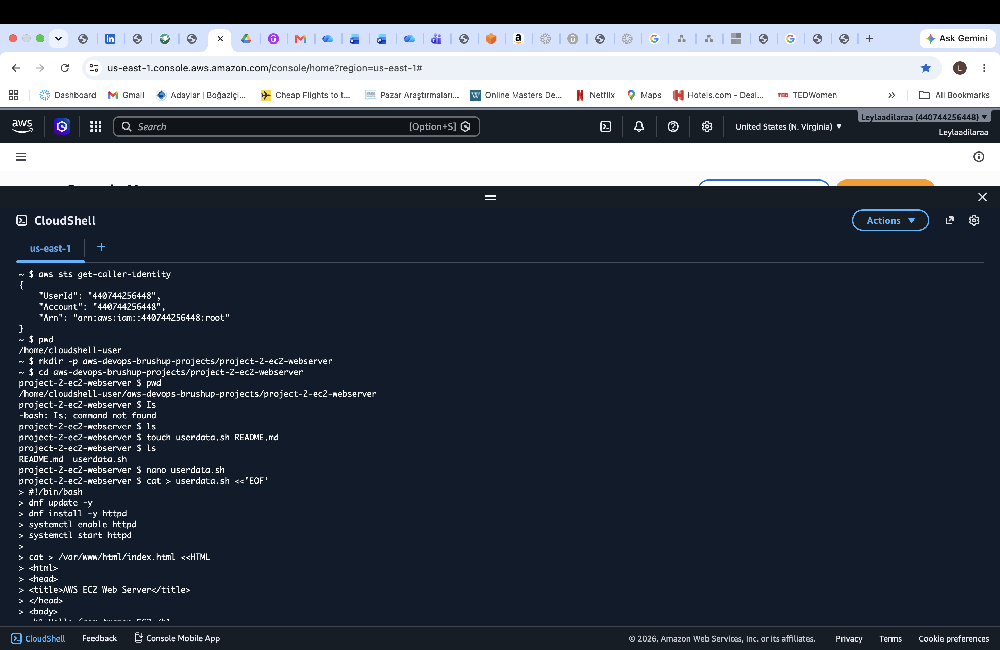

### Security Group Created
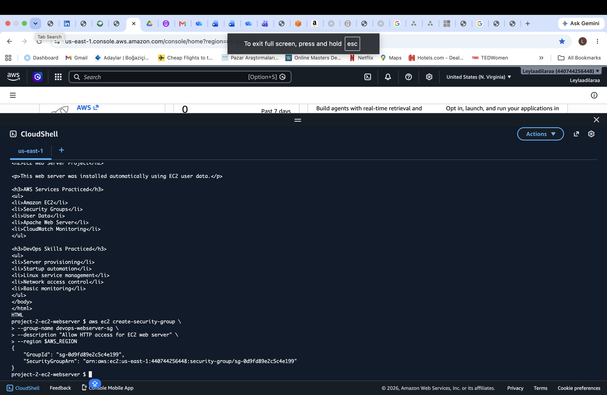

### Security Group Console
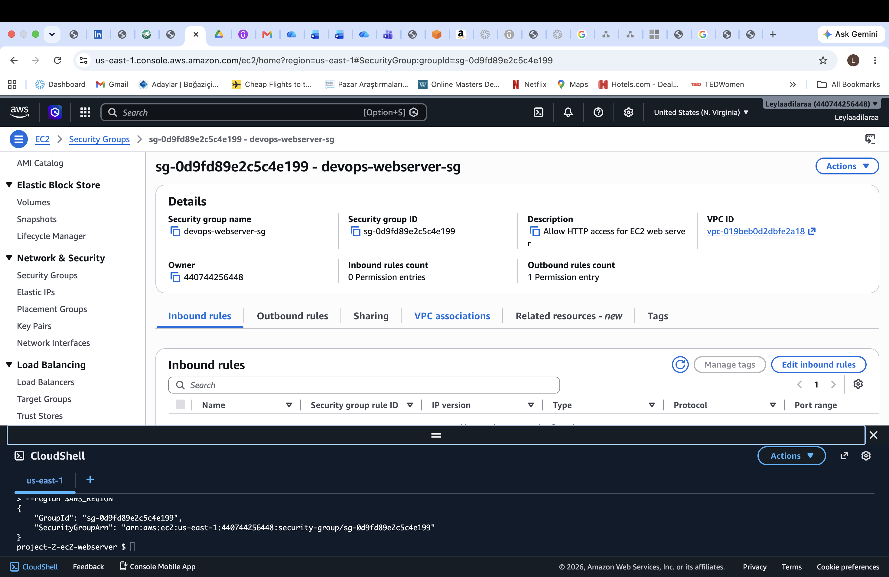

### HTTP Rule
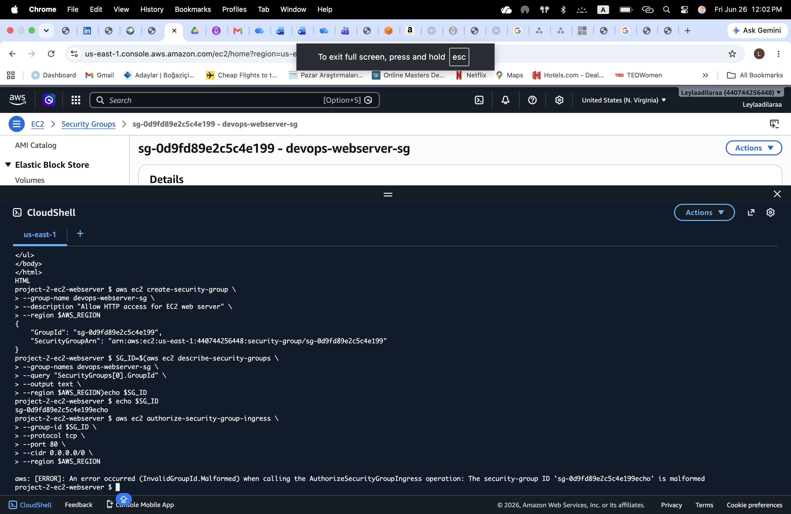

### EC2 Instance Created
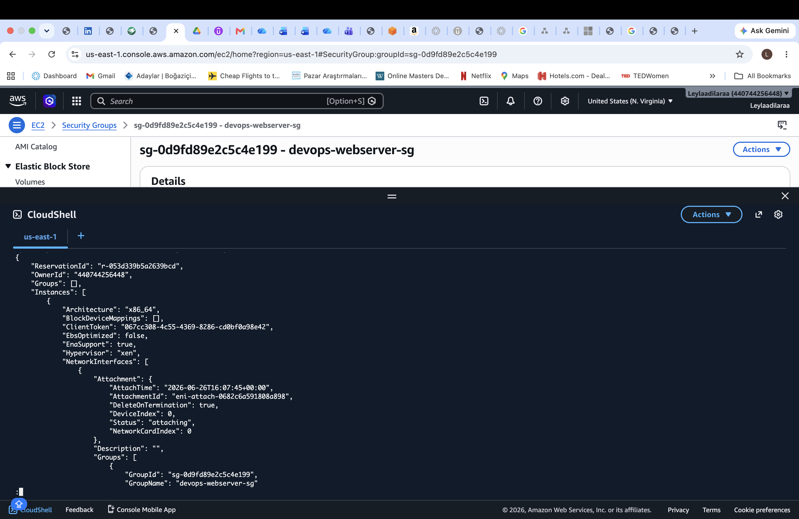

### Instance ID
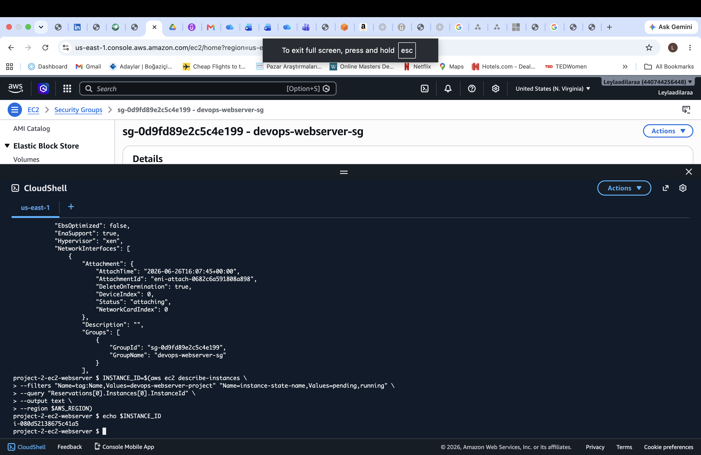

### Public IP
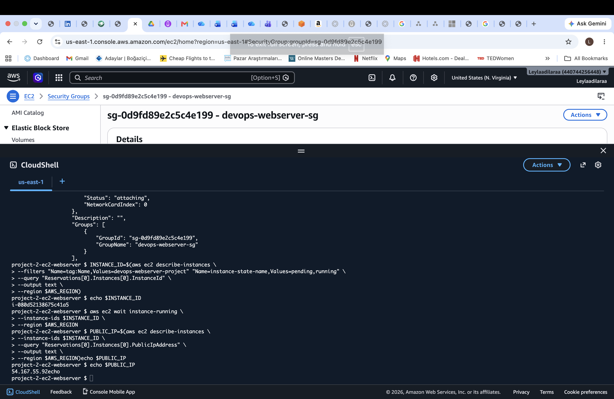

### Browser Not Loading
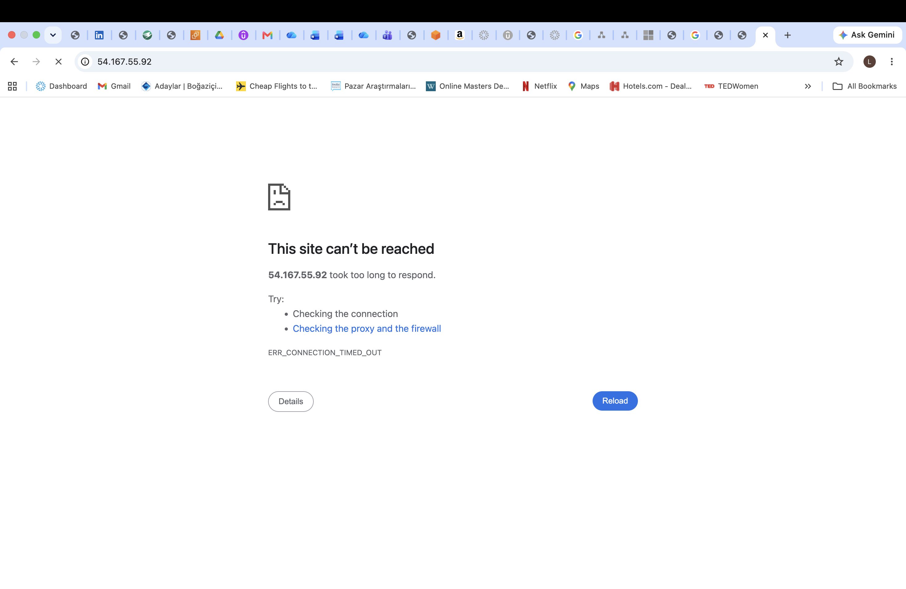

### Security Group HTTP Rule Verification
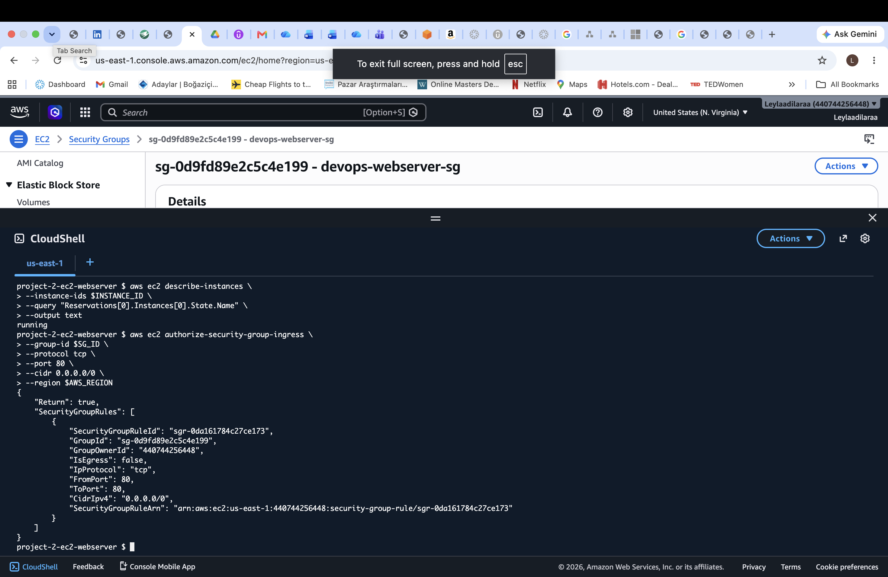

### cURL Test Success
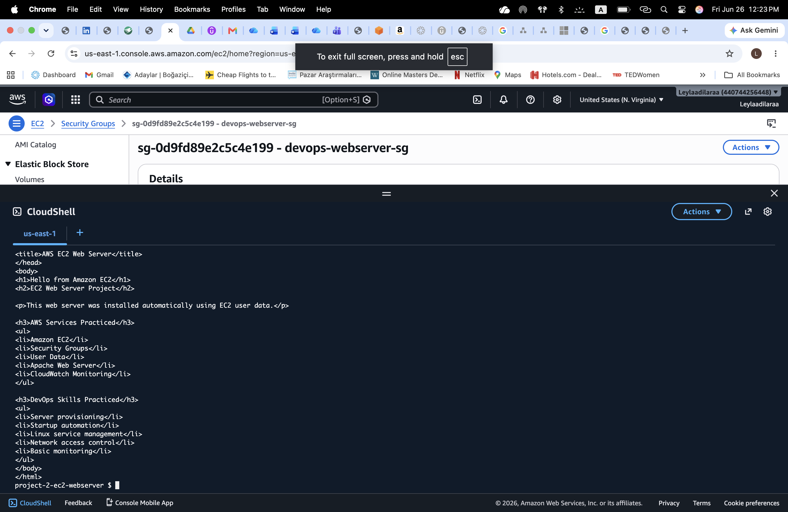

### Browser Webpage
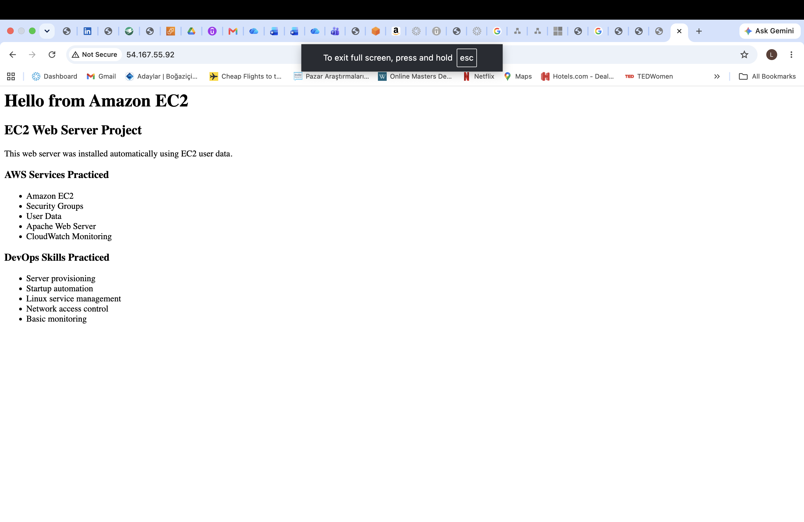

---

## Author

Leyla Dilara Dinç
